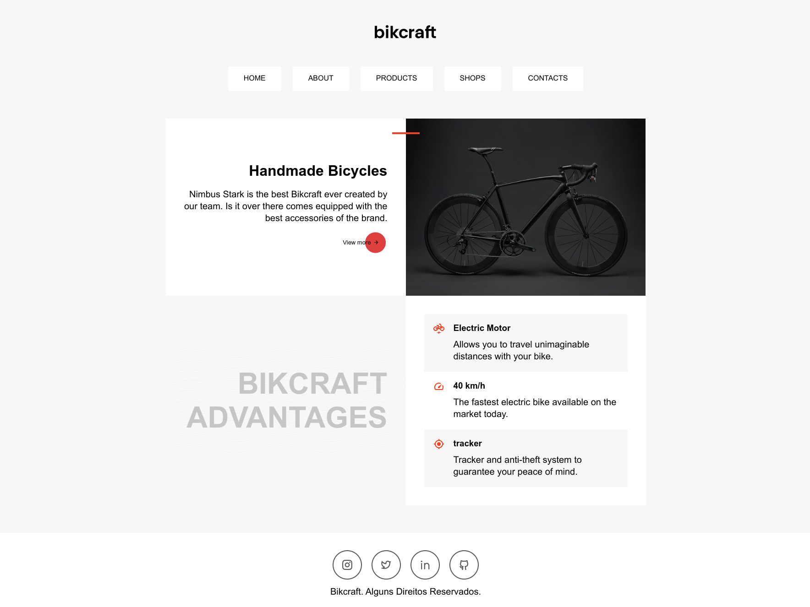

<h1 align="center">BIKCREAFT Landing Page</h1>

<h1 align="center">
   
</h1>

# 📔 Summary

- [📔 Summary](#-summary)
- [📖 About](#-about)
- [🚀 Technologies](#-technologies)
- [🤔 How to contribute](#-how-to-contribute)

# 📖 About

Stylish and clean landing page design. To practice studies in basic knowledge, feel free to use ACADEMIC ONLY

# 🚀 Technologies

This project was developed with the following technologies:

- [JS](https://www.javascript.com/)
- [HTLM](https://www.learn-html.org/)
- [CSS](https://devdocs.io/css/)

 
  
  
  

   

 

# 🤔 How to contribute

- Make a fork;
- Create a branck with your feature: `git checkout -b my-feature`;
- Commit changes: `git commit -m 'feat: My new feature'`;
- Make a push to your branch: `git push origin my-feature`.

After merging your receipt request to done, you can delete a branch from yours.

Thanks to <a href="https://www.origamid.com/">Origamid</a> for sharing this knowledge

  
  
 